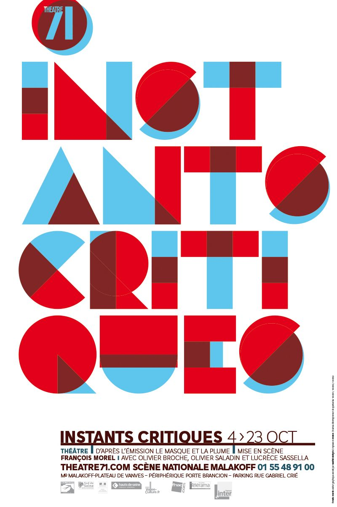
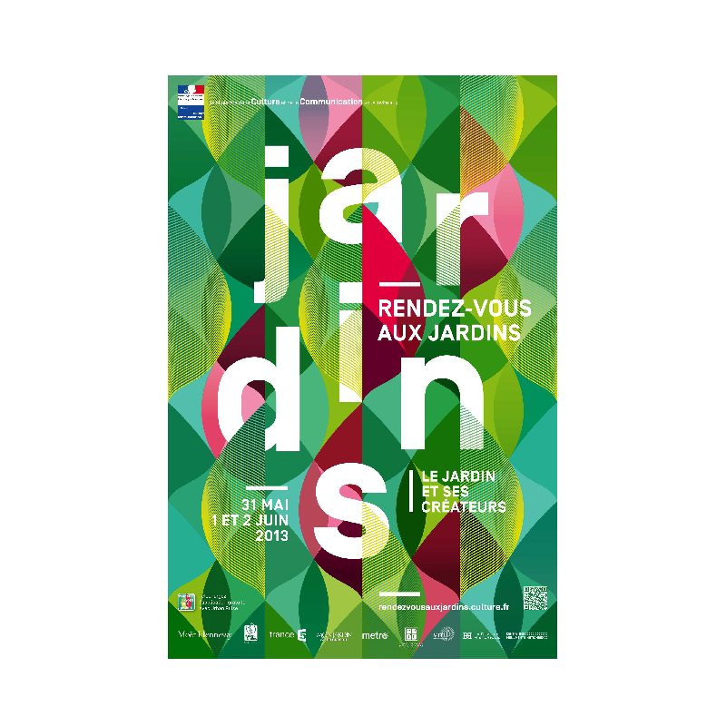
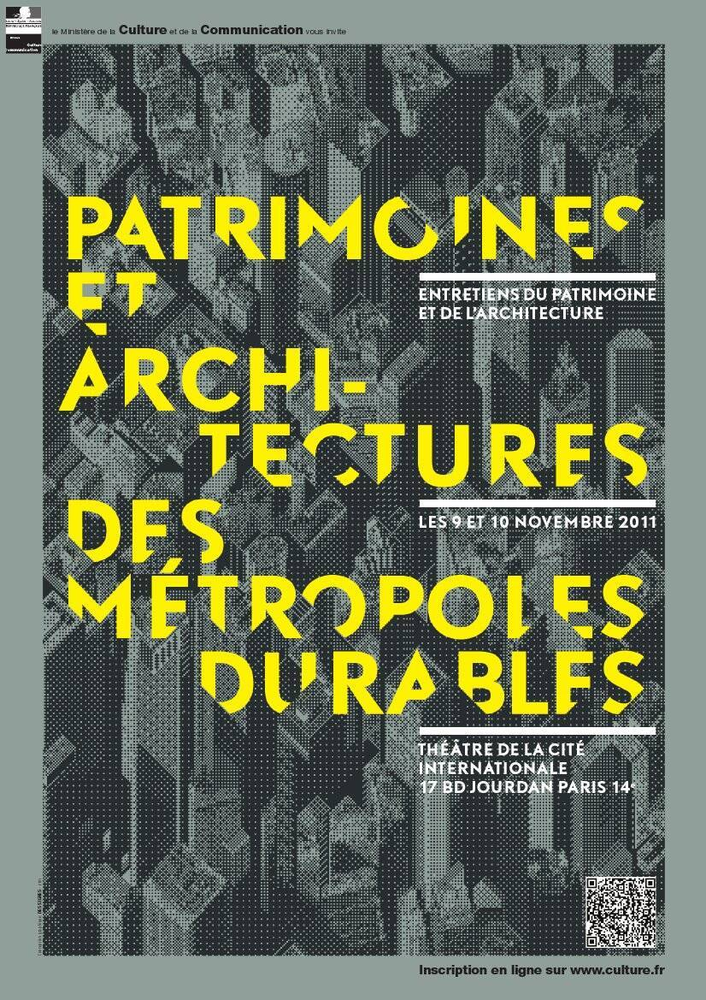
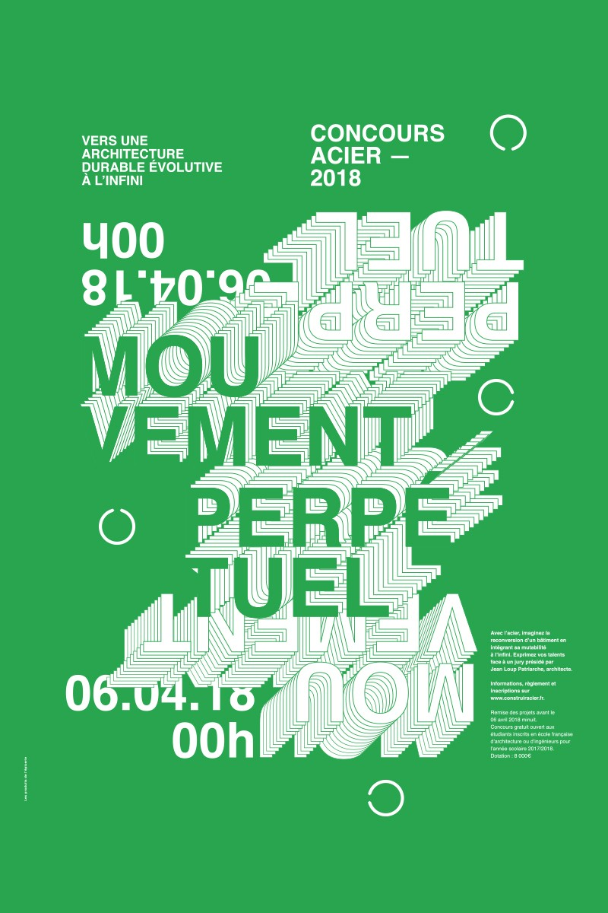
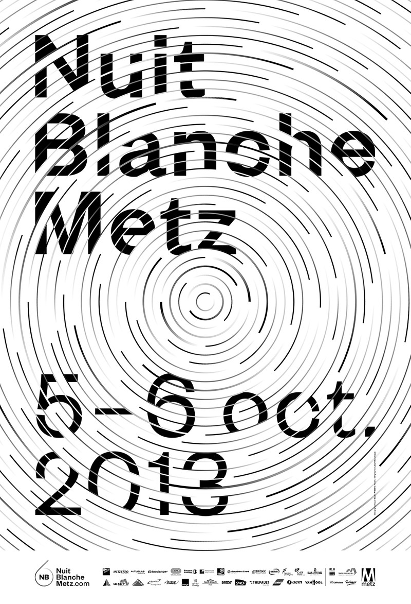
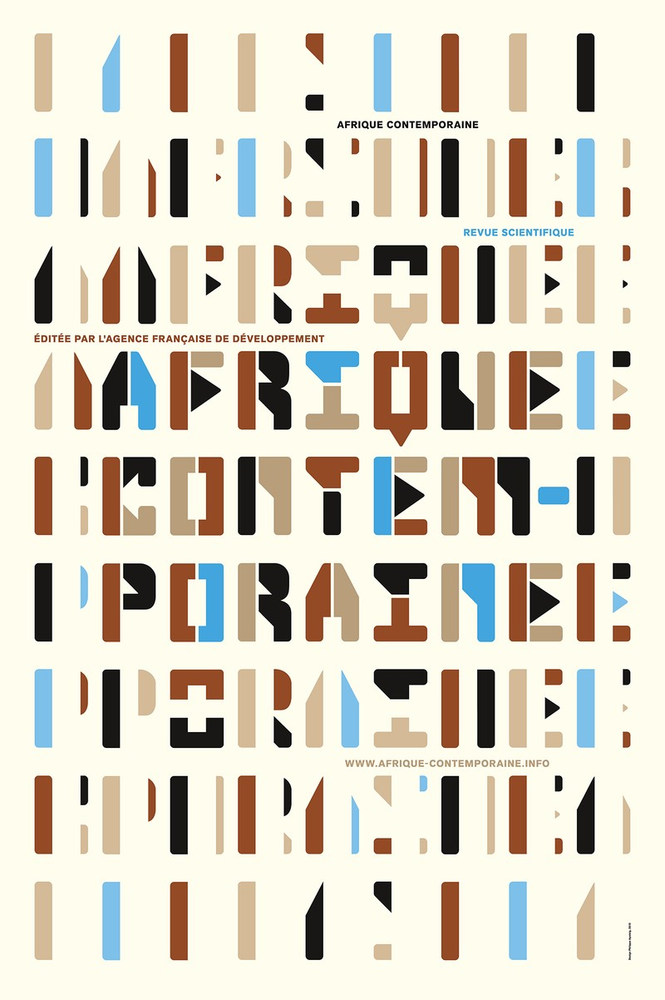
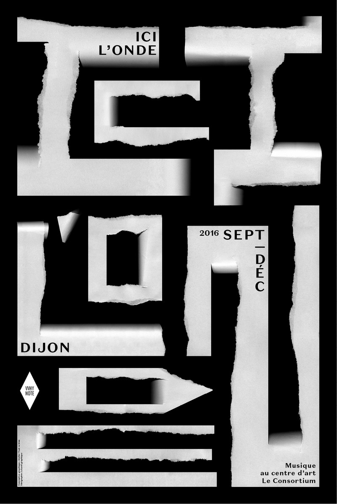
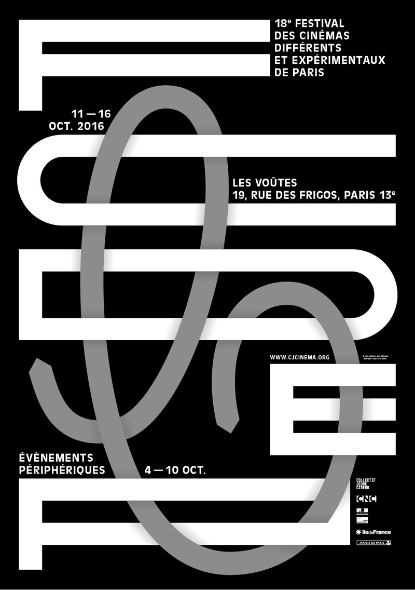
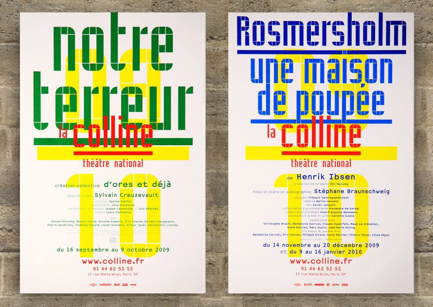

# DG1 — Projet n°6 — mars 2020

## Planning

Brief le lundi 9 mars et rendu de projet le vendredi 13 mars (soutenance face à un jury)

## Demande

Vous réaliserez la prochaine affiche (édition 2021) de l'un des festivals suivants :
- Festival international des jardins, Chaumont sur Loire
- Printemps de Bourges
- Terres du Son, Château de Candé à Monts
- Dreamhack, Palais des congrès de Tours
- American Tours Festival
- VitiLoire

## Contraintes

- Vous utiliserez la typographie pour composer votre réponse graphique, à l'image des exemples visible sur ce brief.
- Bichromie ou Trichromie uniquement.
- Format Affiche : 40x60cm
- L'affiche devra être animée.
- Votre résultat sera graphique, vif, impactant. Tous les éléments doivent faire sens.
- Attention : n'oubliez pas les éléments d'informations nécessaires à la bonne communication du festival : date, lieu, call to action.

## Inspirations

## Ressources et Documentations

- [Typographic Posters](https://www.typographicposters.com/posters)

 

